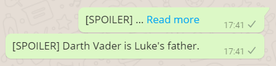

# WhatsApp Spoilers
Send WhatsApp messages with spoiler tags!

## About

If a message is longer than a certain limit, WhatsApp clients will truncate it
and show a "Read more" link instead. By padding a message with 4000 [zero-width
joiners](https://en.wikipedia.org/wiki/Zero-width_joiner), we can force this
behaviour and emulate a spoiler tag.

Read the full write-up at https://blog.jiayu.co/2018/05/whatsapp-spoilers/.

## Credits
Ji An
